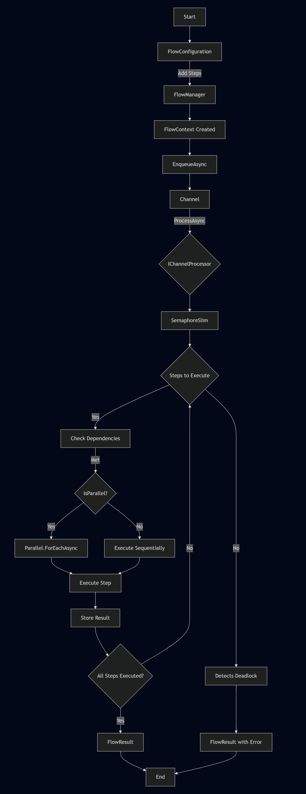

# Adaptive-Flow

**AdaptiveFlow** is a reusable library and design pattern for orchestrating asynchronous workflows in .NET. It allows you to configure and execute sequences of steps with support for dependencies, parallel execution, optional logging, high performance and dynamic configuration via JSON. It is ideal for applications that require flexible and testable pipelines, adaptable to different contexts.

## How it Works

**AdaptiveFlow** organizes the execution of tasks in a structured but flexible pipeline, based on four main components:

1. **Steps:**
- Defined by the `IFlowStep` (no return) or `IFlowStep<TResponse>` (typed return) interfaces.
- Each step is an independent unit of logic that operates on a `FlowContext`, a shared data container.
- Example: One step can validate input data, while another performs a transformation.

2. **FlowConfiguration:**
- Defines the sequence of steps, execution conditions, dependencies, and whether they should be executed in parallel.
- Can be configured programmatically or dynamically via JSON, allowing adjustments at design or runtime.

3. **FlowManager:**
- Orchestrates the execution of steps, respecting dependencies and managing concurrency and parallelism.
- Uses a channel (`Channel<FlowContext>`) to queue and process contexts asynchronously, with configurable limits to support high load.
- Supports optional logging and allows overriding channel processing via `IChannelProcessor`.

4. **FlowContext:**
- A thread-safe key-value dictionary that transports data between steps, facilitating communication and shared state.

 

## Benefits

- **Flexibility:** Dynamic configuration via JSON or code allows adjustments without recompilation.
- **Scalability:** Support for concurrency and channel limits ensures performance under high load.
- **Testability:** Abstracted components such as `IChannelProcessor` facilitate simulations in tests.
- **Security:** Dynamic configuration requires explicit registration of allowed types.

## Use Cases

- Batch data processing.
- Validation and transformation of inputs in APIs.
- Continuous integration or ETL (Extract, Transform, Load) pipelines.

# Getting Start
    
- See documentation [here](/doc/Summary.md)

# Contributions

Feel free to open issues or pull requests in the repository. Suggestions to improve the library are always welcome!

# MIT License

Copyright (c) 2025 Rafael Souza

Permission is hereby granted, free of charge, to any person obtaining a copy
of this software and associated documentation files (the "Software"), to deal
in the Software without restriction, including without limitation the rights
to use, copy, modify, merge, publish, distribute, sublicense, and/or sell
copies of the Software, and to permit persons to whom the Software is
furnished to do so, subject to the following conditions:

The above copyright notice and this permission notice shall be included in all
copies or substantial portions of the Software.

THE SOFTWARE IS PROVIDED "AS IS", WITHOUT WARRANTY OF ANY KIND, EXPRESS OR
IMPLIED, INCLUDING BUT NOT LIMITED TO THE WARRANTIES OF MERCHANTABILITY,
FITNESS FOR A PARTICULAR PURPOSE AND NONINFRINGEMENT. IN NO EVENT SHALL THE
AUTHORS OR COPYRIGHT HOLDERS BE LIABLE FOR ANY CLAIM, DAMAGES OR OTHER
LIABILITY, WHETHER IN AN ACTION OF CONTRACT, TORT OR OTHERWISE, ARISING FROM,
OUT OF OR IN CONNECTION WITH THE SOFTWARE OR THE USE OR OTHER DEALINGS IN THE
SOFTWARE.